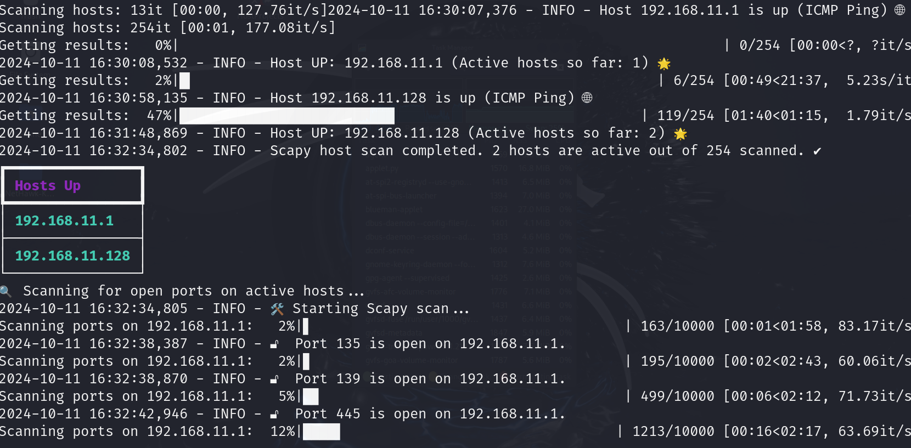

# NetHawk 🦅: AI-Powered Ethical Hacking & Network Vulnerability Assessment 🔍💻🛡️🌐

[](https://github.com/sergio11/nethawk_analyzer)  
[](https://github.com/sergio11/nethawk_analyzer/blob/main/LICENSE)

**NetHawk** is a personal project developed as part of a **Cybersecurity and Ethical Hacking course**. It was created with educational purposes in mind, allowing me to put into practice core concepts in ethical hacking, network analysis, and the use of AI in security automation.

NetHawk utilizes powerful tools like **Scapy** and **Nmap** to perform deep scans, analyze network security, and uncover potential vulnerabilities in target systems. Through AI-driven automation, it also streamlines port scanning, vulnerability detection, and report generation — making learning more interactive and hands-on.

> ⚠️ **Disclaimer:** NetHawk is intended solely for learning and ethical use. It should never be used for malicious purposes.

🙏 **Special thanks to** [Santiago Hernández](https://www.udemy.com/user/shramos/), a leading expert in Cybersecurity and Artificial Intelligence. His outstanding Udemy course on **Cybersecurity and Ethical Hacking** was instrumental in the creation of this project. The knowledge and techniques shared there were essential for building NetHawk. Thank you for your guidance and inspiration!

<p align="center">
  
  
  
</p>

<p align="center">
  
</p>

## ⚠️ Disclaimer  

**NetHawk** has been developed exclusively for educational and research purposes as part of my learning journey in **Ethical Hacking**. This project serves as a practical application of the skills acquired during cybersecurity training, allowing me to experiment in a **controlled lab environment** and include this tool in my **cybersecurity portfolio**.  

This tool is intended **only for authorized testing environments** where explicit permission has been granted. **Unauthorized use on external systems is strictly prohibited** and may violate laws.
I disclaim any responsibility for misuse of this tool. **Always obtain proper authorization** before conducting security assessments.  

## 🌟 **Explore My Other Educational Ethical Hacking Projects**

As part of my journey through cybersecurity and ethical hacking, I've developed a collection of open-source tools to put into practice the concepts I've learned. These projects are intended for **educational purposes**, helping both myself and others gain hands-on experience in areas like network analysis, vulnerability detection, and penetration testing.

Here are some of the tools I've built:

- [🦅 **NetHawk**](https://github.com/sergio11/nethawk_analyzer): An **AI-powered educational tool** for performing **network vulnerability assessments**. Leveraging frameworks like **Scapy** and **Nmap**, it automates **port scanning**, **vulnerability detection**, and **report generation**, helping learners understand how security audits work in practice.
- [💀 **Nemesys**](https://github.com/sergio11/nemesys): A tool built on the **Metasploit Framework**, focused on practicing **exploitation** and **post-exploitation techniques**, including system enumeration and data harvesting.
- [🕷️ **BlackVenom**](https://github.com/sergio11/blackvenom): A tool for learning about **ARP** and **DNS spoofing** and how they can be used to intercept and analyze network traffic in a controlled, ethical environment.
- [🌐 **ZeroTrace**](https://github.com/sergio11/zero_trace_hacking_tool): A project focused on **search engine dorking**, helping identify publicly exposed data and understand how sensitive information can be indexed and discovered online.
- 🔐 **DecryptX**: A learning tool for **hash analysis** and **password strength evaluation**, allowing users to explore real-world scenarios involving password security and encryption.
- [🌑 **EclipseRecon**](https://github.com/sergio11/eclipserecon): A web reconnaissance tool for discovering hidden paths, subdomains, and possible vulnerabilities. Ideal for practicing the **recon phase** of ethical hacking.
- [🌐 **ZoneGuardian**](https://github.com/sergio11/zoneguardian): A DNS analysis tool that helps detect misconfigurations and vulnerabilities in domain setups — a key skill in understanding infrastructure security.
- 🔍 **Retrospect**: Focused on digital forensics and security research, this tool allows users to analyze historical web data to find **past misconfigurations or exposed data**.

Each of these projects was created to reinforce learning through real practice. Feel free to explore them, adapt them, and use them to grow your skills in ethical hacking and cybersecurity. 💻🔍

## 🌟 Key Features of NetHawk:

- 🔧 **Multi-Tool Scanning**: Combines the capabilities of Scapy and Nmap to offer thorough network scans, giving users a broad view of potential vulnerabilities.
- 🚪 **Advanced Port Scanning**: Supports TCP, UDP, and Xmas scans to detect open, closed, and filtered ports — ideal for learning how attackers discover network entry points.
- 📊 **Result Consolidation**: Merges results from different tools into a single report, teaching good practices in data organization and analysis.
- ⚡ **High Concurrency**: Demonstrates how to optimize scans for performance using threading and parallel execution — useful for real-world scalability.
- ⏱️ **Customizable Parameters**: Allows users to tweak settings like timeouts and port ranges, encouraging experimentation and deeper understanding of scanning behavior.
- 🤖 **AI-Powered Analysis**: Offers a practical introduction to applying AI logic for automated decision-making in cybersecurity tools.

## 🎯 Educational Use Cases:

- 🔓 **Penetration Testing Practice**: Helps ethical hacking learners simulate attacks in safe environments and recognize potential weaknesses before they’re exploited.
- 🔍 **Network Security Audits**: Supports IT students and professionals in conducting internal scans to identify misconfigurations and learn how to interpret scan data effectively.

## 🔍 Host and Port Scanning Strategy (How It Works):

NetHawk implements a layered scanning approach to teach how different scanning techniques complement each other for comprehensive vulnerability detection.

### 1. **Host Discovery Using Scapy**:
- **ICMP Ping**: Sends echo requests to identify live hosts.
- **TCP SYN and ACK Scans**: Used when ICMP is blocked, to detect hosts through common service ports.
- **Fallback to Socket Scans**: Direct connection attempts are made when both ICMP and TCP probes are inconclusive — simulating real-world firewall evasion tactics.

### 2. **Port Scanning Using Scapy and Nmap**:
- **Scapy**: Performs detailed scans using:
  - **TCP SYN** (Stealth scan)
  - **UDP Scan** (For stateless services)
  - **Xmas Scan** (For analyzing unusual TCP flags responses)
- **Nmap**: Adds service detection, OS guessing, and extended port coverage.

Results are then **merged**, avoiding duplicates and giving a clearer view of open services and attack surfaces.

### 3. **Results Aggregation and Analysis**:
- By combining Scapy and Nmap outputs, NetHawk produces an educational, high-fidelity vulnerability map — allowing learners to understand how attackers and defenders might see a network differently.

## 🌐 Learning with the NetHawk API

As part of the educational design of NetHawk, the tool includes a simplified yet powerful **Python API** to practice concepts such as **network scanning**, **service enumeration**, and **automation in cybersecurity**.

This API abstracts many complexities of lower-level tools like Scapy and Nmap, providing a great opportunity to understand how these tools can be integrated and automated for ethical hacking purposes.

### 1. 🚀 **Initialization (`__init__`)**

The core component is the `NetHawkAnalyzer` class. When initializing it, you provide basic configuration parameters such as:

- `**network_range**`: The target IP range (e.g., `192.168.1.0/24`) — a key part of any scan.
- `**timeout**`: Scan timeout (in seconds), helping manage performance.
- `**groq_api_key**` and `**model_id**` (optional): For integrating with AI models, great for experimenting with automated decision-making.

> 🧠 **Learning Tip:** Initializing scanning tools with flexible parameters is key to adapting them for different environments.

### 2. 🔍 **Host Scanning (`scan_hosts`)**

This method detects live devices on the network. It introduces two scanning strategies:

- `**arp**`: Uses ARP packets — ideal for local networks and very fast.
- `**scapy**`: Performs more robust host discovery, useful for filtered or protected networks.

> 💡 Great for learning how attackers map networks and how to detect hosts even when firewalls are present.

### 3. 🚪 **Port Scanning (`scan_ports` and `scan_all_ports`)**

Understanding how to scan for open ports is fundamental in network security. These methods allow exploration of:

- **TCP SYN Scan**: Classic "stealth" technique used in many real-world assessments.
- **UDP Scan**: Useful for stateless services that don't use TCP.
- **Xmas Scan**: Sends unusual TCP flag combinations — great for exploring how firewalls react.

`scan_all_ports` runs all techniques at once, providing a complete picture of the host’s exposed services.

> 🔍 **Hands-on Learning:** Try each scan type separately to compare how different firewalls and configurations respond!

### 4. 🛠️ **Service Detection (`scan_services`)**

Once open ports are discovered, this method attempts to identify the services running behind them and gather **banner information**.

> 📚 This is essential for learning **vulnerability assessment**, as knowing the version of a service can help identify known security flaws.

### 5. 📁 **SMB Share Scanning (`scan_smb_shares`)**

Use this method to find **publicly accessible SMB shares**, which can represent serious misconfigurations in real environments.

> 🧪 **Experiment Tip:** Test this in a virtual lab to understand how file sharing services can be exposed without proper restrictions.

### 6. 📝 **Full Network Scan (`run_full_scan`)**

This method puts it all together — a one-stop scan that:

- Detects hosts
- Scans ports
- Identifies services
- Finds SMB shares

The results can be exported to **PDF** and **JSON**, which is excellent for **report writing practice** — a vital skill for ethical hackers and security analysts.

### ⚠️ **Error Handling**

NetHawk includes error management to simulate real-world challenges:

- Raises `ValueError` for invalid scan types or misconfigurations.
- Guides the user with meaningful feedback.

> 🛠️ **Why this matters:** Learning to write and handle clear error messages is essential for building tools that others can use effectively.

## 🖼️ Tool Screenshots

To help visualize how NetHawk works in practice, this section includes real screenshots of the tool in action.

These images show:

- The scanning process
- Results from network analysis
- How findings are organized and presented

This makes it easier to understand the **workflow of a network assessment** and how data is interpreted.

> 🧭 **Explore and Analyze:** Use the screenshots to get familiar with the kinds of outputs NetHawk generates, and reflect on how they can be used to make informed security decisions.


<p align="center">
  
</p>

<p align="center">
  
</p>

<p align="center">
  
</p>

<p align="center">
  
</p>

<p align="center">
  
</p>

<p align="center">
  
</p>

<p align="center">
  
</p>

## 📦 Required Dependencies

| Dependency              | Version    | Description                                                                                   |
|-------------------------|------------|-----------------------------------------------------------------------------------------------|
| **scapy**               | `2.6.0`   | A powerful Python library used for network packet manipulation and analysis.                 |
| **tqdm**                | `4.65.0`   | A fast, extensible progress bar for loops and file processing.                               |
| **rich**                | `13.9.2`  | A library for rich text and beautiful formatting in the terminal.                             |
| **pysmb**               | `1.2.10`  | A Python implementation of the SMB/CIFS protocol for network file sharing.                    |
| **python3-nmap**       | `1.9.1`   | A Python library that allows you to interact with Nmap from your Python scripts.            |
| **langchain**           | `0.2.16`  | A framework for building applications with language models and AI capabilities.               |
| **langchain-groq**      | `0.1.10`  | An extension for Langchain that enables integration with Groq-based systems.                  |
| **fpdf2**               | `2.8.1`   | A library for generating PDF documents using Python.                                         |


## Getting Started with NetHawkAnalyzer 🦅

To run the example provided below, follow these steps:

### Prerequisites

1. **Install NetHawkAnalyzer**:
   Ensure you have the package installed. If you haven't done this yet, you can install it using pip:

   ```bash
   pip install -r examples/requirements.txt
   ```
2. **Set Up Environment Variables**: You need to set up two environment variables: **GROQ_API_KEY** and **MODEL_ID**. You can do this by creating a .env file in your project directory and adding your keys there.

Example .env file:

```bash
GROQ_API_KEY=your_groq_api_key_here
MODEL_ID=your_model_id_here
 ```

**Running the Example**

Here's a sample script that demonstrates how to use NetHawkAnalyzer for network analysis. This script will load your environment variables, initialize the analyzer with a specified network range, and run a full scan.

```python
import os 
from NetHawkAnalyzer.analyzer import NetHawkAnalyzer
from dotenv import load_dotenv

def main():
    # Load environment variables from .env file
    load_dotenv()

    # Retrieve your API key and model ID from environment variables
    groq_api_key = os.getenv("GROQ_API_KEY")
    model_id = os.getenv("MODEL_ID")
 
    # Initialize the NetHawkAnalyzer with your network range
    analyzer = NetHawkAnalyzer(
        network_range="192.168.11.0/24", 
        groq_api_key=groq_api_key, 
        model_id=model_id
    )
    
    # Run a full scan
    results = analyzer.run_full_scan()
    
    # Optionally, process or save the results
    print("Full scan completed!")
    print(results)

if __name__ == "__main__":
    main()
```

### Explanation

- **Loading Environment Variables**: The script uses the `dotenv` library to load environment variables from a `.env` file. This allows you to keep sensitive information secure.

- **Network Analyzer Initialization**: The `NetHawkAnalyzer` is initialized with the specified network range and your API credentials.

- **Running a Scan**: The `run_full_scan()` method is called to perform a comprehensive network analysis.

- **Displaying Results**: Finally, the results of the scan are printed to the console.

### Important Notes

- Make sure to replace `your_groq_api_key_here` and `your_model_id_here` in your `.env` file with your actual API key and model ID.
- Ensure that the specified network range is appropriate for your network setup.

By following these steps, you can successfully run the example script and begin analyzing your network using `NetHawkAnalyzer`! 🔍💻

## ⚠️ Disclaimer  

**NetHawk** has been developed exclusively for educational and research purposes as part of my learning journey in **Ethical Hacking**. This project serves as a practical application of the skills acquired during cybersecurity training, allowing me to experiment in a **controlled lab environment** and include this tool in my **cybersecurity portfolio**.  

This tool is intended **only for authorized testing environments** where explicit permission has been granted. **Unauthorized use on external systems is strictly prohibited** and may violate laws.
I disclaim any responsibility for misuse of this tool. **Always obtain proper authorization** before conducting security assessments.  

## Acknowledgements 🙏

🙏 I would like to express my sincere gratitude to [Santiago Hernández, a leading expert in Cybersecurity and Artificial Intelligence](https://www.udemy.com/user/shramos/). His outstanding course on **Cybersecurity and Ethical Hacking**, available on Udemy, was instrumental in the development of this project. The insights and techniques I gained from his course were invaluable in guiding my approach to cybersecurity practices. Thank you for sharing your knowledge and expertise!

## 🤝 **Contributing**
Contributions to NetHawk are highly encouraged! If you're interested in adding new features, resolving bugs, or enhancing the project's functionality, please feel free to submit pull requests.

## Get in Touch 📬

NetHawk is developed and maintained by **Sergio Sánchez Sánchez** (Dream Software). Special thanks to the open-source community and the contributors who have made this project possible. If you have any questions, feedback, or suggestions, feel free to reach out at  [dreamsoftware92@gmail.com](mailto:dreamsoftware92@gmail.com).

## Visitors Count


 
 ## Please Share & Star the repository to keep me motivated.
  <a href = "https://github.com/sergio11/nethawk_analyzer/stargazers">
     
  </a>

## License ⚖️

This project is licensed under the MIT License, an open-source software license that allows developers to freely use, copy, modify, and distribute the software. 🛠️ This includes use in both personal and commercial projects, with the only requirement being that the original copyright notice is retained. 📄

Please note the following limitations:

- The software is provided "as is", without any warranties, express or implied. 🚫🛡️
- If you distribute the software, whether in original or modified form, you must include the original copyright notice and license. 📑
- The license allows for commercial use, but you cannot claim ownership over the software itself. 🏷️

The goal of this license is to maximize freedom for developers while maintaining recognition for the original creators.

```
MIT License

Copyright (c) 2024 Dream software - Sergio Sánchez 

Permission is hereby granted, free of charge, to any person obtaining a copy
of this software and associated documentation files (the "Software"), to deal
in the Software without restriction, including without limitation the rights
to use, copy, modify, merge, publish, distribute, sublicense, and/or sell
copies of the Software, and to permit persons to whom the Software is
furnished to do so, subject to the following conditions:

The above copyright notice and this permission notice shall be included in all
copies or substantial portions of the Software.

THE SOFTWARE IS PROVIDED "AS IS", WITHOUT WARRANTY OF ANY KIND, EXPRESS OR
IMPLIED, INCLUDING BUT NOT LIMITED TO THE WARRANTIES OF MERCHANTABILITY,
FITNESS FOR A PARTICULAR PURPOSE AND NONINFRINGEMENT. IN NO EVENT SHALL THE
AUTHORS OR COPYRIGHT HOLDERS BE LIABLE FOR ANY CLAIM, DAMAGES OR OTHER
LIABILITY, WHETHER IN AN ACTION OF CONTRACT, TORT OR OTHERWISE, ARISING FROM,
OUT OF OR IN CONNECTION WITH THE SOFTWARE OR THE USE OR OTHER DEALINGS IN THE
SOFTWARE.
```
