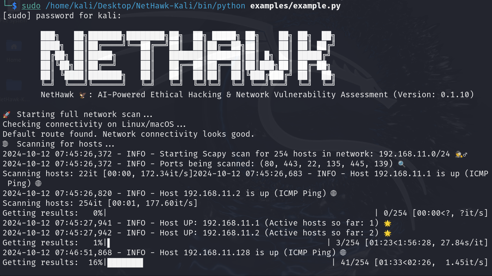

# NetHawk 🦅: AI-Powered Ethical Hacking & Network Vulnerability Assessment 🔍💻🛡️🌐

NetHawk is an advanced, AI-powered tool designed for ethical hacking and comprehensive network vulnerability assessment. Built for cybersecurity professionals, network administrators, and ethical hackers, NetHawk utilizes powerful tools like Scapy and Nmap to perform deep scans, analyze network security, and uncover potential vulnerabilities in target systems.

[](https://github.com/sergio11/nethawk_analyzer)
[](https://pypi.org/project/NetHawkAnalyzer/)
[](https://github.com/sergio11/nethawk_analyzer/blob/main/LICENSE)

Thanks to AI-driven automation and intelligent decision-making, NetHawk simplifies port scanning, vulnerability detection, and report generation, making security audits faster, smarter, and more efficient.

🙏 I would like to express my sincere gratitude to [Santiago Hernández, a leading expert in Cybersecurity and Artificial Intelligence](https://www.udemy.com/user/shramos/). His outstanding course on **Cybersecurity and Ethical Hacking**, available on Udemy, was instrumental in the development of this project. The insights and techniques I gained from his course were invaluable in guiding my approach to cybersecurity practices. Thank you for sharing your knowledge and expertise!

🔒 **Disclaimer**: This tool is designed for educational and research purposes. Misuse of this tool could result in violation of laws and regulations. Please use responsibly.

<p align="center">
  
  
  
</p>

<p align="center">
  
</p>

## 🌟 **Explore My Other Open-Source Ethical Hacking Tools**

If you're interested in more powerful tools for ethical hacking, make sure to check out my other open-source projects designed to help cybersecurity professionals and penetration testers:

- [💀 **Nemesys**](https://github.com/sergio11/nemesys): An advanced **exploitation** and **post-exploitation** tool built on top of the **Metasploit Framework** for automating critical data harvesting and system enumeration.  
- [🕷️ **BlackVenom**](https://github.com/sergio11/blackvenom): The ultimate **ARP** and **DNS spoofing** tool for **intercepting network traffic** and uncovering vulnerabilities with stealth and precision.  
- [🌐 **ZeroTrace**](https://github.com/sergio11/zero_trace_hacking_tool): A powerful **search engine dorking** tool designed to identify **attack vectors** and uncover **exposed sensitive information** across the web.
- [🔐 **DecryptX**](https://github.com/sergio11/decryptx): An **advanced hash and password security assessment tool** that empowers you to analyze **password hashes**, **encrypted ZIP files**, and more. Ideal for evaluating the strength of encryption and identifying weaknesses in **security implementations**.
- [ 🌑 **EclipseRecon**](https://github.com/sergio11/eclipserecon): is a stealthy web reconnaissance tool for uncovering hidden vulnerabilities, subdomains, and site structures. 🕵️‍♂️🔍 It empowers security professionals to identify critical attack surfaces with precision, ensuring proactive defense. 🚨💻

These tools are designed to streamline penetration testing, enhance security assessments, and provide in-depth insights into vulnerabilities. Explore them to level up your ethical hacking skills! 💻🔍

## 🌟 Key Features:

- 🔧 **Multi-Tool Scanning**: Combines the power of Scapy and Nmap to conduct in-depth network scans, ensuring a comprehensive view of network activity and vulnerabilities.
  
- 🚪 **Aggressive and Comprehensive Port Scanning**: Supports TCP, UDP, and Xmas scans to detect open, closed, and filtered ports, identifying potential entry points for attackers.

- 📊 **Result Consolidation**: Merges scan results from both tools to eliminate duplicates, providing a clear and consolidated view of your network's security status.

- ⚡ **High Concurrency**: Efficiently scans wide ranges of ports using multiple threads, allowing for fast and scalable performance for networks of any size.

- ⏱️ **Customizable Settings**: Configure parameters and timeouts according to your network conditions and security requirements.

- 🤖 **AI-Powered Analysis**: Offers smarter vulnerability analysis with actionable insights, helping you take appropriate measures based on findings.

## 🎯 Use Cases:

- 🔓 **Penetration Testing**: Ethical hackers can quickly identify exploitable vulnerabilities in networks, strengthening defenses before malicious actors can attack.

- 🔍 **Network Security Auditing**: IT teams can use NetHawk to audit network security, scanning for open ports, misconfigured services, and hidden vulnerabilities.

## 🔍 Host and Port Scanning Strategy:

NetHawk employs an efficient combination of Scapy and Nmap to perform host and port scanning, providing comprehensive and redundant coverage, ensuring maximum detection of active hosts and open ports, even in networks with firewall defenses.

### 1. **Host Detection with Scapy**:

- **ICMP Ping**: First, NetHawk uses ICMP packets (ping) sent to each host within the target network range to check their availability. If a host responds, it is considered "active."

- **TCP SYN and ACK Scanning**: For hosts that do not respond to the ping, NetHawk performs a TCP SYN scan, sending SYN packets to the most common ports (80, 443, 22, etc.) to identify responses indicating open ports. If no response is received for the SYN, an ACK scan is attempted to determine if the host is responding to TCP packets.

- **Fallback to Socket Scan**: If the previous scans fail (possibly due to firewalls blocking ICMP or SYN packets), a direct connection attempt is made using sockets on the same ports, looking for any response that may indicate an open port.

### 2. **Port Scanning with Scapy and Nmap**:

- **Scapy**: For hosts identified as active, NetHawk uses Scapy to perform deep port scans. Various scan types are supported, including:
  - **TCP SYN**: Sending SYN packets to discover open ports.
  - **UDP Scan**: Using UDP packets to detect open or filtered ports.
  - **Xmas Scan**: Scanning with malformed TCP packets to test for anomalous responses that may indicate filtered or closed ports.

- **Nmap**: NetHawk complements Scapy's results with an Nmap scan, providing additional detection capabilities such as identifying service versions and checking less common ports. Nmap is run by default to scan the most commonly used ports or can be configured for custom scans based on specific security requirements.

- The results from Nmap are consolidated with those from Scapy, eliminating duplicates to offer a clear and detailed final report.

### 3. **Aggregation and Analysis of Results**:

NetHawk combines the results from both scans (Scapy and Nmap) to generate a complete list of active hosts and open ports. By merging results from different approaches, duplication is eliminated, providing a unique view of potential network vulnerabilities. With this combination of techniques, NetHawk ensures complete coverage, detecting hosts and open ports that may be hidden from more conventional scanning methods.

## 🌐 Using the NetHawk API

NetHawk provides a powerful and simplified API for conducting security analyses and network scans. This API abstracts the complexity of using tools like Scapy and Nmap, allowing users to interact with various scanning and vulnerability analysis functions efficiently. Below is a guide to its main methods and functionalities:

#### 1. 🚀 **Initialization (`__init__`)**

The main object of the API is the `NetHawkAnalyzer` class. To get started, you need to provide a network range (`network_range`) and other optional parameters like timeout (`timeout`) and an AI API key if necessary.

- **`network_range`**: The range of IP addresses to scan (e.g., `192.168.1.0/24`).
- **`timeout`**: Timeout in seconds.
- **`groq_api_key`** and **`model_id`**: Optional keys for integration with AI services.

#### 2. 🔍 **Host Scanning (`scan_hosts`)**

This method detects active devices on the network, supporting the following scanning methods:

- **`arp`**: Fast, based on ARP, but limited to local networks.
- **`scapy`**: More advanced scanning that can detect hosts through firewalls.

The result is a list of active hosts ready for the next step.

#### 3. 🚪 **Port Scanning (`scan_ports` and `scan_all_ports`)**

NetHawk scans ports using various techniques to detect open ports:

- **TCP SYN**: Detects open TCP ports.
- **UDP Scan**: Scans for open or filtered UDP ports.
- **Xmas Scan**: Uses malformed packets to identify filtered ports.

The **`scan_all_ports`** method runs all scan types simultaneously to provide a comprehensive view of open ports on each host.

#### 4. 🛠️ **Service Detection (`scan_services`)**

NetHawk allows the identification of services running on open ports and retrieves banner information:

- **`scan_services`**: Scans a list of hosts to detect services and versions, which is crucial for identifying potential vulnerabilities.

#### 5. 📁 **SMB Share Scanning (`scan_smb_shares`)**

You can also scan hosts for public SMB shares:

- **`scan_smb_shares`**: Detects shared resources via SMB, helping identify unauthorized access points in the network.

#### 6. 📝 **Full Network Scan (`run_full_scan`)**

For a comprehensive analysis, use the **`run_full_scan`** method, which combines all scanning functionalities into a single operation:

- This method performs host discovery, port scanning, service detection, and SMB share enumeration.
- Results can be output in both PDF and JSON formats for detailed reporting and analysis.

### ⚠️ **Error Handling**

The API raises specific errors for known issues, such as:

- **`ValueError`**: Raised for unknown scanning methods.
- Proper error handling ensures users are informed of any issues during the scanning process.

## 🖼️ Tool Screenshots

In this section, we showcase various screenshots of **NetHawk** in action. These visuals illustrate the user interface, scanning processes, and results generated by our AI-powered ethical hacking and network vulnerability assessment tool. Each screenshot highlights the key features and functionalities, providing an insight into how **NetHawk** simplifies the auditing of network security.

Explore the following images to see how **NetHawk** works and the valuable information it can uncover for cybersecurity professionals, network administrators, and ethical hackers alike!


<p align="center">
  
</p>

<p align="center">
  
</p>

<p align="center">
  
</p>

<p align="center">
  
</p>

<p align="center">
  
</p>

<p align="center">
  
</p>

<p align="center">
  
</p>

## 📦 Required Dependencies

| Dependency              | Version    | Description                                                                                   |
|-------------------------|------------|-----------------------------------------------------------------------------------------------|
| **scapy**               | `2.6.0`   | A powerful Python library used for network packet manipulation and analysis.                 |
| **tqdm**                | `4.65.0`   | A fast, extensible progress bar for loops and file processing.                               |
| **rich**                | `13.9.2`  | A library for rich text and beautiful formatting in the terminal.                             |
| **pysmb**               | `1.2.10`  | A Python implementation of the SMB/CIFS protocol for network file sharing.                    |
| **python3-nmap**       | `1.9.1`   | A Python library that allows you to interact with Nmap from your Python scripts.            |
| **langchain**           | `0.2.16`  | A framework for building applications with language models and AI capabilities.               |
| **langchain-groq**      | `0.1.10`  | An extension for Langchain that enables integration with Groq-based systems.                  |
| **fpdf2**               | `2.8.1`   | A library for generating PDF documents using Python.                                         |


## Getting Started with NetHawkAnalyzer 🦅

To run the example provided below, follow these steps:

### Prerequisites

1. **Install NetHawkAnalyzer**:
   Ensure you have the package installed. If you haven't done this yet, you can install it using pip:

   ```bash
   pip install -r examples/requirements.txt
   ```
2. **Set Up Environment Variables**: You need to set up two environment variables: **GROQ_API_KEY** and **MODEL_ID**. You can do this by creating a .env file in your project directory and adding your keys there.

Example .env file:

```bash
GROQ_API_KEY=your_groq_api_key_here
MODEL_ID=your_model_id_here
 ```

**Running the Example**

Here's a sample script that demonstrates how to use NetHawkAnalyzer for network analysis. This script will load your environment variables, initialize the analyzer with a specified network range, and run a full scan.

```python
import os 
from NetHawkAnalyzer.analyzer import NetHawkAnalyzer
from dotenv import load_dotenv

def main():
    # Load environment variables from .env file
    load_dotenv()

    # Retrieve your API key and model ID from environment variables
    groq_api_key = os.getenv("GROQ_API_KEY")
    model_id = os.getenv("MODEL_ID")
 
    # Initialize the NetHawkAnalyzer with your network range
    analyzer = NetHawkAnalyzer(
        network_range="192.168.11.0/24", 
        groq_api_key=groq_api_key, 
        model_id=model_id
    )
    
    # Run a full scan
    results = analyzer.run_full_scan()
    
    # Optionally, process or save the results
    print("Full scan completed!")
    print(results)

if __name__ == "__main__":
    main()
```

### Explanation

- **Loading Environment Variables**: The script uses the `dotenv` library to load environment variables from a `.env` file. This allows you to keep sensitive information secure.

- **Network Analyzer Initialization**: The `NetHawkAnalyzer` is initialized with the specified network range and your API credentials.

- **Running a Scan**: The `run_full_scan()` method is called to perform a comprehensive network analysis.

- **Displaying Results**: Finally, the results of the scan are printed to the console.

### Important Notes

- Make sure to replace `your_groq_api_key_here` and `your_model_id_here` in your `.env` file with your actual API key and model ID.
- Ensure that the specified network range is appropriate for your network setup.

By following these steps, you can successfully run the example script and begin analyzing your network using `NetHawkAnalyzer`! 🔍💻

## Acknowledgements 🙏

🙏 I would like to express my sincere gratitude to [Santiago Hernández, a leading expert in Cybersecurity and Artificial Intelligence](https://www.udemy.com/user/shramos/). His outstanding course on **Cybersecurity and Ethical Hacking**, available on Udemy, was instrumental in the development of this project. The insights and techniques I gained from his course were invaluable in guiding my approach to cybersecurity practices. Thank you for sharing your knowledge and expertise!

## 🤝 **Contributing**
Contributions to NetHawk are highly encouraged! If you're interested in adding new features, resolving bugs, or enhancing the project's functionality, please feel free to submit pull requests.

## Get in Touch 📬

NetHawk is developed and maintained by **Sergio Sánchez Sánchez** (Dream Software). Special thanks to the open-source community and the contributors who have made this project possible. If you have any questions, feedback, or suggestions, feel free to reach out at  [dreamsoftware92@gmail.com](mailto:dreamsoftware92@gmail.com).

## Visitors Count


 
 ## Please Share & Star the repository to keep me motivated.
  <a href = "https://github.com/sergio11/nethawk_analyzer/stargazers">
     
  </a>


[](https://github.com/sergio11/nethawk_analyzer)
[](https://pypi.org/project/NetHawkAnalyzer/)

## License ⚖️

This project is licensed under the MIT License, an open-source software license that allows developers to freely use, copy, modify, and distribute the software. 🛠️ This includes use in both personal and commercial projects, with the only requirement being that the original copyright notice is retained. 📄

Please note the following limitations:

- The software is provided "as is", without any warranties, express or implied. 🚫🛡️
- If you distribute the software, whether in original or modified form, you must include the original copyright notice and license. 📑
- The license allows for commercial use, but you cannot claim ownership over the software itself. 🏷️

The goal of this license is to maximize freedom for developers while maintaining recognition for the original creators.

```
MIT License

Copyright (c) 2024 Dream software - Sergio Sánchez 

Permission is hereby granted, free of charge, to any person obtaining a copy
of this software and associated documentation files (the "Software"), to deal
in the Software without restriction, including without limitation the rights
to use, copy, modify, merge, publish, distribute, sublicense, and/or sell
copies of the Software, and to permit persons to whom the Software is
furnished to do so, subject to the following conditions:

The above copyright notice and this permission notice shall be included in all
copies or substantial portions of the Software.

THE SOFTWARE IS PROVIDED "AS IS", WITHOUT WARRANTY OF ANY KIND, EXPRESS OR
IMPLIED, INCLUDING BUT NOT LIMITED TO THE WARRANTIES OF MERCHANTABILITY,
FITNESS FOR A PARTICULAR PURPOSE AND NONINFRINGEMENT. IN NO EVENT SHALL THE
AUTHORS OR COPYRIGHT HOLDERS BE LIABLE FOR ANY CLAIM, DAMAGES OR OTHER
LIABILITY, WHETHER IN AN ACTION OF CONTRACT, TORT OR OTHERWISE, ARISING FROM,
OUT OF OR IN CONNECTION WITH THE SOFTWARE OR THE USE OR OTHER DEALINGS IN THE
SOFTWARE.
```
